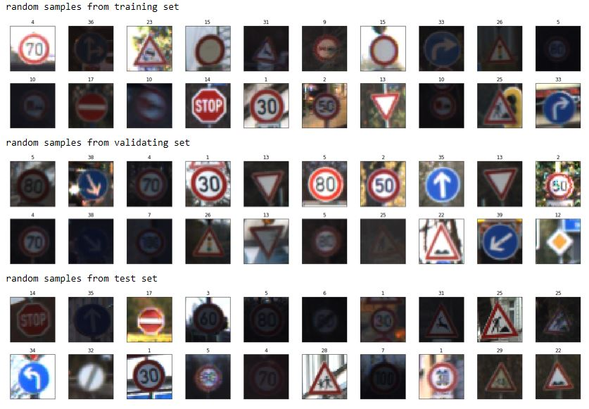

# **Traffic Sign Recognition** 

## Writeup

---

**Build a Traffic Sign Recognition Project**

The goals / steps of this project are the following:
* Load the data set (see below for links to the project data set)
* Explore, summarize and visualize the data set
* Augment the original dataset
* Design, train and test a model architecture based on LeNet
* Use the model to make predictions on new images
* Analyze the softmax probabilities of the new images

## Rubric Points
### Here I will consider the [rubric points](https://review.udacity.com/#!/rubrics/481/view) individually and describe how I addressed each point in my implementation.  

---
### Data Set Summary & Exploration

#### 1. Provide a basic summary of the data set. In the code, the analysis should be done using python, numpy and/or pandas methods rather than hardcoding results manually.

Three sets of data (training, validation and test) are provided as pickle files. I loaded those files and used numpy library to calculate summary statistics of the traffic signs data set:

* The size of training set is 34799
* The size of the validation set is 4410
* The size of test set is 12630
* The shape of a traffic sign image is (32, 32, 3)
* The number of unique classes/labels in the data set is 43

#### 2. Include an exploratory visualization of the dataset.

Here is an exploratory visualization of the data set. It's a collage of random selected all test data set. It's the most vivid way to show images. 

#### 3. Augment the data by scaling and rotating

This will significanlty increase the total number of files and also better reflect images taken in different circumstances.

### Design and Test a Model Architecture

#### 1. The input data is normalized from 0..255 value reprentation to 0-1 floa

Have also tried to transform it to grayscale, but didn't have much improvement to accuracy in my experiment. So removed it later.

As a last step, I normalized the image data considering how CNN work. CNNs learn by continually adding gradient error vectors (multiplied by a learning rate) computed from backpropagation to various weight matrices. If we didn't scale our input training vectors, the ranges of our distributions of feature values would likely be different for each feature and cause issues. 

#### 2.Used standard LeNet as the base and added dropout to the two fully connected layers: fc1, fc2

My final model consisted of the following layers:

| Layer         		|     Description	        					| 
|:---------------------:|:---------------------------------------------:| 
| Input         		| 32x32x3 RGB image   							| 
| Convolution 3x3     	| 1x1 stride, same padding, outputs 32x32x64 	|
| RELU					|												|
| Max pooling	      	| 2x2 stride,  outputs 16x16x64 				|
| Convolution 3x3	    | etc.      									|
| Fully connected		| two - both with dropouts					| 
| Softmax				| etc.        									|
|						|												|
|						|												|
 

#### 3. Use optimization function to reduce the loss at given learning rate. 

To train the model, I used tf.train.AdamOptimizer as the optimization function. loss function is tf.reduce_mean() of the cross entropy, which further uses tf.nn.softmax_cross_entropy_with_logits(). 

#### 4. Used augmentation and added dropout into base LeNet, I was able to get 93.9% accuracy

My final model results were:
* validation set accuracy of 0.944
* test set accuracy of 0.939

If an iterative approach was chosen:
* Standard LeNet used
* but it did not consider dropout. 
* I added dropout and tuned parameters, such as EPOC, batches and learning rate.
* In my experience, data augmentation, dropout and normalization all contributed to the accuracy

### Test a Model on New Images

#### 1. Choose five German traffic signs found on the web and provide them in the report. For each image, discuss what quality or qualities might be difficult to classify.

Here are five German traffic signs that I found on the web:

Those images might be difficult because I download them from Internet and they're very bright, zoomed-in and some even with watermarks if looking closely. 

#### 2. Discuss the model's predictions on these new traffic signs and compare the results to predicting on the test set. At a minimum, discuss what the predictions were, the accuracy on these new predictions, and compare the accuracy to the accuracy on the test set (OPTIONAL: Discuss the results in more detail as described in the "Stand Out Suggestions" part of the rubric).

Here are the results of the prediction: 0.8

The model was able to correctly guess 4 of the 5 traffic signs, which gives an accuracy of 80%.

#### 3. Describe how certain the model is when predicting on each of the five new images by looking at the softmax probabilities for each prediction. Provide the top 5 softmax probabilities for each image along with the sign type of each probability. (OPTIONAL: as described in the "Stand Out Suggestions" part of the rubric, visualizations can also be provided such as bar charts)

The code for making predictions on my final model is located in the 11th cell of the Ipython notebook.

For the first image, the model is relatively sure that this is a stop sign (probability of 0.6), and the image does contain a stop sign. The top five soft max probabilities were (the probabilities are shown in the image subject)

 

### (Optional) Visualizing the Neural Network (See Step 4 of the Ipython notebook for more details)
#### 1. Discuss the visual output of your trained network's feature maps. What characteristics did the neural network use to make classifications?

 
